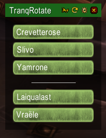
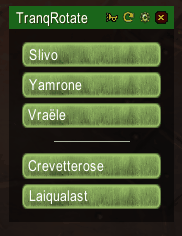
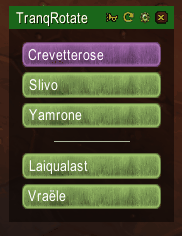

# TranqRotate

This addon is meant to help hunters to setup tranqshot rotation and give them real time visual feedback about it.

It also allow non-hunter raid leaders to easily manage, report and watch the tranq rotation live. 

This addon will work even if you are the only one using it in your raid. (With some combat log range limitation, see bellow)

   

## Feedback

I'm looking for feedback ! I've set up a small discord server to get in touch : https://discord.gg/bPFyvDe
 
Please report any issue on github : https://github.com/Slivo-fr/TranqRotate/issues

## Features

- Automatically send messages to notify others player about your tranq success or fail, hopefully you won't have to bother with that crappy macro anymore !
- Display the list of raid hunters
- Display offline and dead status on hunters frames
- Allow player to re-order players between two groups : main rotation and backup
- Synchronize rotation order between addon users
- Allow player to broadcast the configured rotation and backup group to the raid
- Provide a real time visual feedback about the rotation status, even if no one else use the addon in your raid
- Synchronize tranqshot casts to other player using the addon
- Whisper backup hunters (if there is backup) or next rotation hunter if you miss your tranqshot
- Test mode out of raid using arcane shot
- Play a sound when you are next on rotation
- Show an alert and play a sound when you need to use your tranqshot
- Display the tranq cooldown of each hunter
- Display the frenzy cooldown of each boss
- Optional automatic backup call when incapacitated
- Optional automatic timed backup call 
- Prints to chat name and reason of a tranq fail (miss or resist)
- Show an indicator on hunters that does not use the addon

## Usage
 
Use `/tranq` for options

You must be in a raid for hunters to get registered and displayed by the addon.

First step is to setup your tranq rotation using drag & drop on hunters, if others hunters use the addon too, changes will be synced. 
You may use the trumpet button to report the rotation in raid chat so others players without the addon can know what you planned. 
Please note the backup group is hidden if empty but you can still drag hunters into it.

You can now just pull the boss and start shooting your tranqshots, TranqRotate will track the rotation and use a purple tranq-like color on the next hunter that should tranq. TranqRotate will play sounds when the previous hunter shot and you are the next, as well as when you have to use your tranqshot.

**Warning** : if all of your hunters does not use the addon, make sure someone with the addon stay within 45m range of hunters without the addon or you won't be able to register their tranqshot. MC and AQ40 tranq encounters might lead to range issues. However, I didn't had any complain about this yet  :) 

You can use the reset button in the top bar to reset the rotation state if it do not clear itself.
The reset button is also able to resync raid hunters and rotation setup if you need.

You may adds the `/tranq backup` command to a macro that you can use when you are unable to tranq and you need some help,
It will whisper all backup hunters the fail message.

The `/tranq check` command allows you to list version or TranqRotate used by others hunters and others non-hunters players

## Roadmap

Here is a list of feature I want to implement at some point, no specific order is decided yet.

- Automatic handling of death and disconnection of hunters on the rotation group (swap with a backup, send an alert about it)
- Use raid symbols to mark hunters that need to tranq, or that need to backup a failed tranqshot
- Automatic reset of rotation when raid wipe
- Adds raid markers to tranq announces if target has one

## Download

Do not use github download button on this page, get the latest release zip file from https://github.com/Slivo-fr/TranqRotate/releases

Also available here https://www.curseforge.com/wow/addons/tranqrotate and there https://wowclassicui.com/fr/addons/tranqrotate
